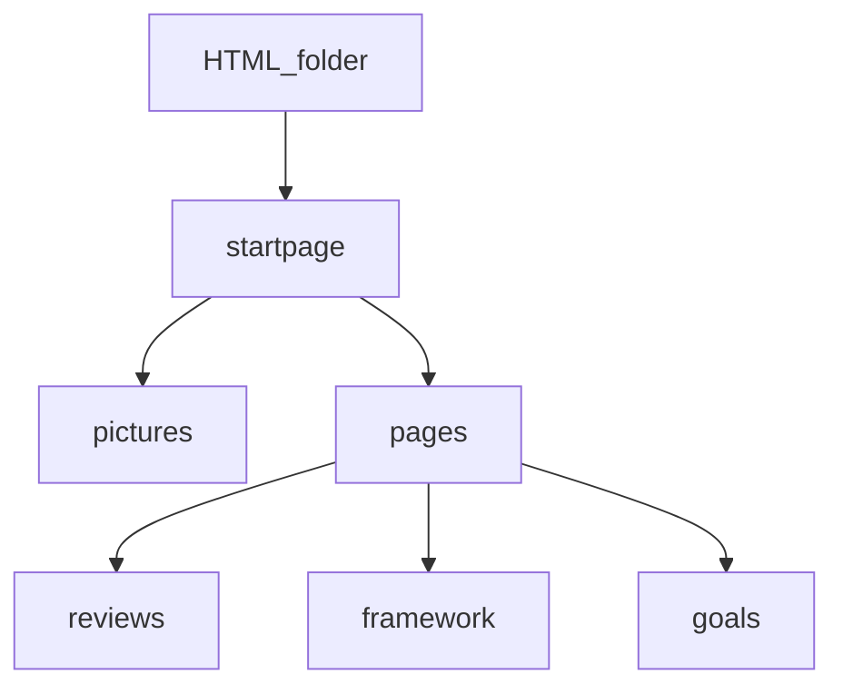

# HTML framework system

[work folder](P:\Public Folder\html framework)
[Index](http://startpage.gilly.st)
[local index](P:\Public Folder\html framework\index.html)

Purpose is to build a comprehensive html static website to reflect my workflow and use a bookmark/shortcut to my most used files and systems.
# use lessons from head first html
- [ ]
# Structure
1. startpage
2. framework
3. reviews
4. Goals

# Startpage
The startpage must be minimalist to reduce distraction but it must look modern and nice.

## Content:
1. Motivation title
2. date and time
3. personalised message

4. Tools
  - Mails[proton]
  - Calendar[nextcloud]
  - Task[todoist]

5. productive
  - fitness [garmin][withings]
  - finance[ynab]
  - storage[onedrive][pcloud][nextcloud]

6. bookmarks
- amazon[amazon]
- reddit[reddit]
- covid[worldometer]

## html strucutre
header
  title
  date and time
  motivation quote
cards
  card tools
  card productive
  card bookmarks

## style
- general style: large page with minimalist borders and line
- background: space picture with blur effect
- font: monospace
- color: white and red

##  class

- [x] cards for the bookmarks
- [x] cardholder for the container of the cards
- [x] gate for the links
- [x] gates for the list of links
- [x] cardtitle for the card title
- [x] devise for the title
- [x] dateclock for the date and time
- [x] todayquote for today quote

## style the class

List:

- remove the bullet : `list-style: none;`
- remove the offset:`  padding: 0;   margin: 0;`

Links

- remove text decoration: ``

# Todo
give class to list item, links and style them independantly
Review global style from moder html

